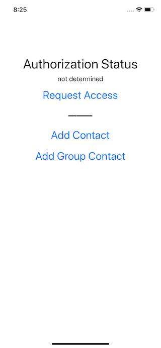

## Apple's Bug Reporter Information ##

**Problem ID:** 23211838

**Title:** The `CNContactViewController(forNewContact:)` fails to render if `parentContainer` or `parentGroup` are populated.

**Created:** October 21, 2015 at 8:16 PM

## Contacts Documentation ##
https://developer.apple.com/documentation/contactsui/cncontactviewcontroller

## Failure Message ##
```
Using group: Friends
BrokenContacts[4099:136342] [CNUI ERROR] error calling service - Couldn’t communicate with a helper application.
```

## Steps to Reproduce ##

1. Launch App



___

2. Tap the `Request Access` button


___

3. Authorize Access by tapping on `OK`


___

4. Tap `Add Group Contact`


___

5. Expected Results


